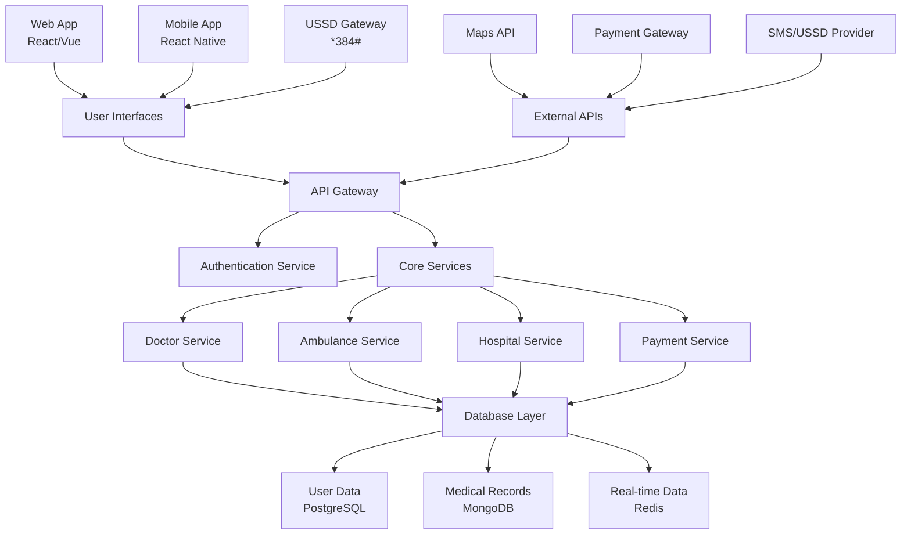

# 🏥 AfyaBora Healthcare System

<div align="center">
  
  [](https://git.io/typing-svg)
  
  [](LICENSE)
  []()
  []()
  
</div>

## 🌟 Overview

**AfyaBora Healthcare System** is a comprehensive digital health platform designed to **bridge healthcare gaps in both urban and remote areas**. The system empowers citizens to seamlessly request and access medical services including doctors, ambulances, and hospitals through multiple channels: **Web**, **Mobile Apps**, and **USSD**.

### 🎯 Mission
To democratize healthcare access by leveraging technology, ensuring that quality medical services reach every corner of Kenya and beyond, regardless of geographical location or technological barriers.

### 🌍 Impact
- **Universal Access**: Serves both tech-savvy urban users and rural communities with limited internet access
- **Emergency Response**: Rapid ambulance and emergency medical service coordination
- **Doctor Consultation**: Connect patients with certified healthcare professionals
- **Hospital Network**: Streamlined hospital booking and referral system

---

## ✨ Key Features

<div align="center">

### 🏥 **Core Services**

</div>

| Feature | Description | Platforms |
|---------|-------------|-----------|
| 👨‍⚕️ **Doctor Consultation** | Connect with certified medical professionals for online consultations | Web, Mobile, USSD |
| 🚑 **Ambulance Services** | Request emergency ambulance services with real-time tracking | Web, Mobile, USSD |
| 🏥 **Hospital Booking** | Browse and book appointments with nearby hospitals and clinics | Web, Mobile |
| 💊 **Prescription Management** | Digital prescription handling and pharmacy integration | Web, Mobile |
| 📱 **Multi-Platform Access** | Seamless experience across web, mobile apps, and USSD | All Platforms |
| 🌐 **Offline Support** | USSD functionality for users without internet access | USSD |
| 📍 **Location Services** | GPS-based service provider matching and routing | Web, Mobile |
| 💳 **Payment Integration** | Multiple payment options including mobile money | All Platforms |

### 🎯 **Advanced Features**

- **Real-time Tracking**: Live ambulance and service provider tracking
- **Multi-language Support**: Swahili and English language options
- **Emergency Alerts**: Immediate notification system for critical cases
- **Health Records**: Digital patient history and medical record management
- **Rating System**: Community-driven provider ratings and reviews
- **Telemedicine**: Video consultation capabilities
- **Pharmacy Network**: Integrated prescription delivery system

---

## 🏗️ System Architecture

<div align="center">



</div>

---

## 🛠️ Technology Stack

<div align="center">

### **Frontend**


### **Backend**


### **Database**


### **Mobile & Communication**


### **Cloud & DevOps**


</div>

---

## 📱 Platform Support

### 🌐 **Web Application**
- **Responsive Design**: Works seamlessly on desktop, tablet, and mobile browsers
- **Progressive Web App**: Offline capabilities and push notifications
- **Cross-browser Compatibility**: Chrome, Firefox, Safari, Edge

### 📱 **Mobile Applications (Coming soon)**
- **Android**: Native Android experience with React Native
- **iOS**: Full iOS compatibility and App Store ready
- **Cross-platform**: Single codebase for both platforms

### 📞 **USSD Integration**
- **Universal Access**: Works on any mobile phone, including feature phones
- **Offline Functionality**: No internet connection required
- **Local Language**: Swahili and English support
- **USSD Code**: `*384*AFYABORA#`

---

## 🚀 Installation

### Prerequisites

```bash
# Required software
- Node.js (v16 or higher)
- PHP (v8.0 or higher)
- Composer
- PostgreSQL
- MongoDB
- Redis
- Docker (optional)
```

### Backend Setup (Laravel API)

```bash
# Clone the repository
git clone https://github.com/simiyu-samuel/afyabora_healthcare.git
cd afyabora_healthcare

# Install PHP dependencies
composer install

# Setup environment variables
cp .env.example .env
php artisan key:generate

# Configure database in .env file
DB_CONNECTION=pgsql
DB_HOST=127.0.0.1
DB_PORT=5432
DB_DATABASE=afyabora_db
DB_USERNAME=your_username
DB_PASSWORD=your_password

# Run migrations and seeders
php artisan migrate
php artisan db:seed

# Start the server
php artisan serve
```

### Frontend Setup (React)

```bash
# Navigate to frontend directory
cd frontend

# Install dependencies
npm install

# Start development server
npm start
```

### Mobile App Setup (React Native)

```bash
# Navigate to mobile directory
cd mobile

# Install dependencies
npm install

# For Android
npx react-native run-android

# For iOS
npx react-native run-ios
```

### Docker Setup (Optional)

```bash
# Build and run with Docker Compose
docker-compose up -d --build

# The application will be available at:
# Web: http://localhost:3000
# API: http://localhost:8000
```

---

## 📖 Usage

### 🌐 **Web Platform**

1. **Register/Login**: Create account or sign in
2. **Select Service**: Choose from Doctor, Ambulance, or Hospital services
3. **Book Appointment**: Select provider and preferred time
4. **Make Payment**: Secure payment processing
5. **Track Service**: Real-time updates on service status

### 📱 **Mobile App (Future enhancement)**

1. **Download**: Install from Google Play Store or Apple App Store
2. **Location Permission**: Enable GPS for nearby services
3. **Emergency Button**: Quick access to emergency services
4. **Consultation**: Video/audio calls with doctors

### 📞 **USSD Access**

```
Dial: *03*AFYABORA#

Main Menu:
1. Doctor Consultation
2. Ambulance Service
3. Hospital Booking
4. My Account
5. Help

Follow prompts to complete your request
```

---

## 📚 API Documentation

### Base URL
```
Development: http://localhost:8000/api/v1
```

### Authentication
```bash
# Login and get token
POST /auth/login
{
  "email": "user@example.com",
  "password": "password"
}
---
### 📞 USSD Interface
```
   AFYABORA HEALTH
   ================
   1. Doctor (24/7)
   2. Ambulance 🚑
   3. Hospital 🏥
   4. My Account
   5. Help & Support
   
   Enter choice: _
```

---

## 🤝 Contributing

We welcome contributions from the community! Here's how you can help:

### 🔧 **Development Process**

1. **Fork** the repository
2. **Create** a feature branch (`git checkout -b feature/amazing-feature`)
3. **Commit** changes (`git commit -m 'Add amazing feature'`)
4. **Push** to branch (`git push origin feature/amazing-feature`)
5. **Open** a Pull Request

### 📋 **Contribution Guidelines**

- Follow the existing code style and conventions
- Write clear, concise commit messages
- Add tests for new features
- Update documentation as needed
- Ensure all tests pass before submitting

### 🐛 **Bug Reports**

Please use the GitHub issue tracker with:
- Clear description of the bug
- Steps to reproduce
- Expected vs actual behavior
- Screenshots (if applicable)
- System information

---

## 📄 License

This project is licensed under the **MIT License** - see the [LICENSE](LICENSE) file for details.

```
MIT License

Copyright (c) 2024 Samuel Simiyu

Permission is hereby granted, free of charge, to any person obtaining a copy
of this software and associated documentation files (the "Software"), to deal
in the Software without restriction, including without limitation the rights
to use, copy, modify, merge, publish, distribute, sublicense, and/or sell
copies of the Software...
```

---
---
## 👨‍💻 About the Developer

<div align="center">
  
  **Samuel Simiyu** - *Full Stack Developer*
  
  [](https://simiyu-samuel.github.io/Portfolio-latest)
  [](mailto:simiyusamuel869@gmail.com)
  [](https://wa.me/254796590401)
  
</div>

---

## 🙏 Acknowledgments

- **Healthcare Partners**: Local hospitals and clinics for their collaboration
- **Community**: Beta testers and healthcare workers who provided feedback
- **Open Source**: Various open-source libraries that made this project possible

---

<div align="center">
  
  ### 🌟 *"Bridging healthcare gaps, one connection at a time."*
  
  <br>
  
  
  
  <br>
  
  **⭐ If you find this project helpful, please consider giving it a star!**
  
  <br>
  
  
  
</div>
